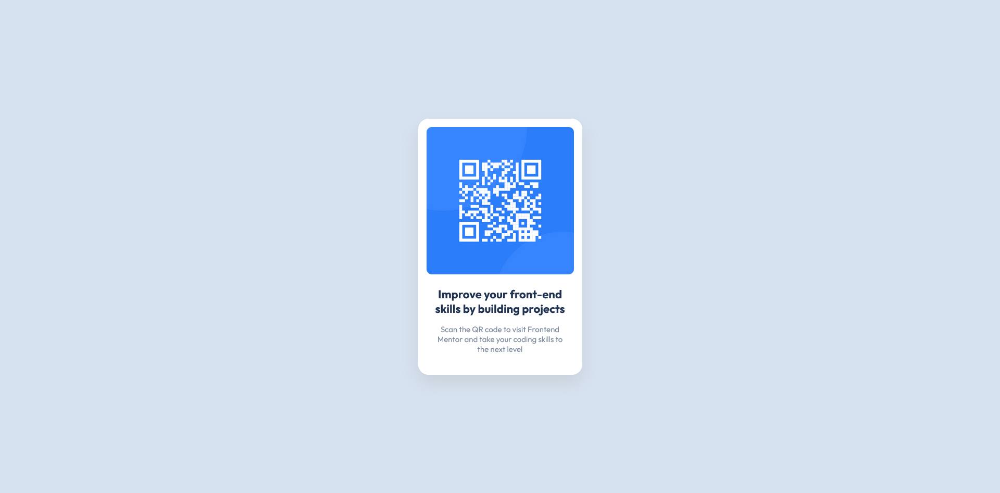

# Frontend Mentor - QR code component solution

This is a solution to the [QR code component challenge on Frontend Mentor](https://www.frontendmentor.io/challenges/qr-code-component-iux_sIO_H).
Frontend Mentor challenges help you improve your coding skills by building realistic projects. 

## Table of contents

- [Overview](#overview)
  - [Screenshot](#screenshot)
  - [Links](#links)
- [My process](#my-process)
  - [Built with](#built-with)
- [Author](#author)

## Overview

### Screenshot

### Links

- Solution URL: [https://github.com/totarochristian/qr-code-component](https://github.com/totarochristian/qr-code-component)
- Live Site URL: [https://qr-code-component-h9oj219i3-totarochristian.vercel.app](https://qr-code-component-h9oj219i3-totarochristian.vercel.app)

## My process

### Built with

- Semantic HTML5 markup
- CSS custom properties

## Author

- GitHub - [@totarochristian](https://github.com/totarochristian)
- Frontend Mentor - [@totarochristian](https://www.frontendmentor.io/profile/totarochristian)